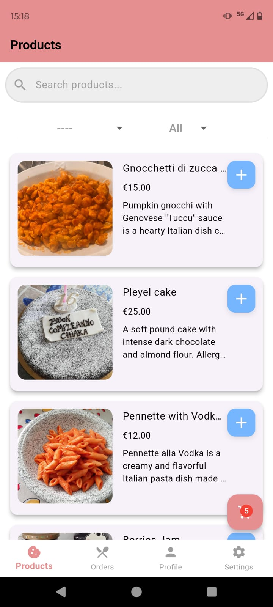

# Final Report on Marapp

## Introduction
This report presents a detailed overview of the development process of our mobile application, including the challenges faced, solutions implemented, and the final execution steps. The application was developed using Dart and Flutter, with Firebase as the backend service.

## Implementation Details
The application was built with the following technologies:
- **Frontend:** Flutter (Dart)
- **Backend:** Firebase (Firestore Database, Authentication), Imgur (image storage), OpenCage (street finder), EmailJs (email sender), OneSignal (Notification sender)


### Key Features
- User authentication
- Data storage and retrieval using Firebase Firestore
- Image storage workaround due to Firebase free-tier limitations
- Alternative solution instead of Google API

## Challenges and Solutions

### 1. Firebase API Limitations
**Issue:** One of the primary challenges was Firebase's free-tier limitations, particularly with image storage and mapping services. The basic plan imposed restrictions that affected the development.

**Solution:** We implemented a workaround by using Imgur for image storage, which provided more flexibility. For maps, we integrated an alternative service to avoid the limitations imposed by Firebase using OpenCage services.

### 2. User Permissions
**Issue:** Managing user permissions within Firebase Authentication was more complex than anticipated.

**Solution:** We created custom Firebase rules to manage user permissions effectively, ensuring that data access was restricted appropriately.


### 3. Absence of Firebase Functions
**Issue:** Firebase's free-tier does not support Cloud Functions, which would have automated tasks and triggers.

**Solution:** We used client-side logic to replace Cloud Functions and implemented background tasks within the app to achieve similar results.


## How to Execute the Application
### Prerequisites
To run the app, you need to install:
- Flutter SDK
- Android Studio (or another IDE like Visual Studio Code)
- Dart SDK

### Steps to Run the App
1. **Download the Source Code**: Available on AulaWeb.
2. **Extract the Project**: Unzip the project folder.
3. **Install Dependencies**: Run:
   ```sh
   flutter pub get
   ```
4. **Run the App**:
   ```sh
   flutter run
   ```

<br><br>


# **Application Structure and Implementation**

The logical structure of the project is inside the `lib` folder, while the packages are installed in the project using `pubspec.yaml`. Every time this file is updated, it's important to run the command:

```
flutter pub get
```

Everything starts from `main.dart`, where the app execution is redirected to a custom splash screen. All the code is inside `lib/`. We have implemented **Provider** and **Services** for authentication to keep it separate from the app's screens.  

Users can authenticate using **email and password** or via **Google Sign-In**.  
All screens and their logic are inside the `views/` folder.

Once authenticated, the user is redirected to `HomeScreen`.  
On Firebase, each user is registered with a **PlayerId** generated by `auth_services`, allowing **OneSignal** to send notifications to that specific user.  
The app asks for notification permission **only once** during registration. This is handled inside the `PushNotificationService` class (`utils/push_notification_service.dart`) with the method:

```dart
PushNotificationService.initializeOneSignal();
```

This method is called during user registration.

---

### **Real-time Order Status Monitoring**
Inside `PushNotificationService`, we have implemented a method to monitor **order status updates**. This method is called inside the splash screen so that the app starts listening immediately.

Whenever the **order status changes**, the app sends a request to **OneSignal** to push a notification to the user.  
We implemented this using a **stream** to detect real-time changes in Firestore:

```dart
FirebaseFirestore.instance
    .collection('orders') // Orders collection
    .snapshots()
    .listen((snapshot) {
  for (var doc in snapshot.docChanges) {
    if (doc.type == DocumentChangeType.modified) {
      var order = doc.doc.data()!;
      String orderStatus = order['status']; // Order status
      String userId = order['userId']; // User ID
      String orderId = doc.doc.id;
```

#### **How it works:**
- `.snapshots().listen((snapshot) {...})` creates a **real-time stream** of updates.
- Whenever a document in the `orders` collection is **modified**, Firestore sends an update, and the code inside `listen` runs automatically.
- The app detects the change, **captures the new status**, and **sends a notification to OneSignal**.

---

### **API Requests**
For every API request, we interact with the system using an **HTTP POST request** with a **JSON body**, including headers like `Content-Type: application/json` and an **Authorization API Key**.  
Example:

```dart
var response = await http.post(
  Uri.parse("https://onesignal.com/api/v1/notifications"),
  headers: headers,
  body: body,
);

if (response.statusCode == 200) {
  print("✅ Notification sent successfully: ${response.body}");
} else {
  print("❌ Error sending notification: ${response.body}");
}
```

🔹 **All API keys** are stored in the `.env` file (root folder) and accessed in the code using **dotenv**, e.g., for notifications:

```dart
dotenv.env['ONE_SIGNAL_API_KEY']
```

Make sure to import:

```dart
import 'package:flutter_dotenv/flutter_dotenv.dart';
```


---

Once registered/authenticated, either through the registration process or the initial splash screen, the user is taken to the **HomeScreen**, where they can navigate between the **Products, Orders, Profile, and Settings** screens.  
Navigation can be done either by tapping the respective icons in the **BottomNavigationBar** or by swiping horizontally. This functionality is achieved using Flutter’s **PageView**.

---

### **Main Screens:**

#### **SETTINGS:**  
In the **Settings** screen, we have implemented:  
- **Theme selection**, with styles defined in `utils/theme.dart`.  
- **Push notification testing**, via the static method `sendTestPushNotification(String playerId)`.  
- **Screen orientation selection**.  

For **theme and screen orientation preferences**, we use **Shared Preferences**, allowing the user to either follow the system settings or choose their preferred configuration. These preferences are loaded in `main.dart` every time the app runs.  

Additionally, we have implemented an **introductory page** that redirects to the **Home** screen.  

---

#### **PROFILE:**  
**Features:**  
- Profile screen displaying the **profile picture**.  
- **Add photo icon** (camera icon).  
- **Edit profile** button to modify user information.  
- **Favorites** section.  
- **Payment method management**.  

#### **Flutter Code Structure Note:**  
Unlike native Android, in Flutter, everything is managed within the **codebase**.  
- **Widgets** are used for UI elements.  
- **Methods/functions** manipulate these widgets.  

##### **Essential methods for Firebase interaction:**  
1. **`Future<T>`** (Asynchronous)  
   - Returns a single value **at some point in the future** (e.g., after an HTTP request or database read).  
   - Execution **continues** without waiting for the value.  

2. **`Stream<T>`** (Asynchronous, Continuous)  
   - Returns multiple values **over time**, useful for real-time data like Firestore updates or notifications.  

**Importance for the Profile Section:**  
- **`Future`** loads the user data **once** when opening the profile.  
- **`Stream`** is used for **real-time updates**, ensuring profile changes (like the name or picture) are reflected **instantly** without refreshing the page.  
- **Example:**  
  - **`Future`** loads Firebase data when opening the profile.  
  - **`Stream`** updates the **profile picture and name** dynamically.

##### **Editing Profile:**  
Users can update:
- **name**  
- **Phone number**  
- **Address**  
- **Password**  

For **address selection**, we use **OpenCage API**, which provides intelligent search suggestions. This is implemented in **`AddressSearchDelegate`** (`views/profile/address_search.dart`).  

###### **AddressSearchDelegate Workflow:**  
1. User types an address → `fetchSuggestions(query)` calls OpenCage API for suggestions.  
2. **`FutureBuilder`** updates the UI as suggestions become available.  
3. User selects an address → `close(context, suggestion)` finalizes selection.  

**Extra actions:**  
- **🔄 "Clear" button** to reset input.  
- **⬅ "Back" button** to exit the search.  
- **🔑 Key point:** **`FutureBuilder`** ensures a responsive UI **without blocking** the app.  

---

### **Profile Picture Management:**  
Implemented in **`ProfilePictureUploader`** (`views/profile/upload_photo.dart`).  

**Functionality:**  
1. User taps the **camera icon** → system instantiates `ProfilePictureUploader`.  
2. The async method `Future<String> pickAndUploadImage` allows selecting from **Camera or Gallery**.  
3. Image bytes are **compressed** before uploading to **Imgur**.  
4. **Imgur API** (with a generated token) is used to upload images.  
5. The **photo URL** is stored in **Firestore** (`users` collection, under the authenticated user's document).  
6. The profile picture is displayed using:  
   ```dart
   NetworkImage(profilePicUrl)
   ```  
   Since the image is public but **hidden**, only the profile owner (or anyone with the link) can access it.

##### **Please note Navigation in Flutter:**  
- **`Navigator.push`** → Opens a new screen.  
- **`Navigator.pop`** → Closes the current screen and returns to the previous one.  

---

### **Favorites Section:**  
- Displays **favorite products** selected by the user by tapping the **heart icon** in the products page.  
- Implemented using a **`favorites` collection** in Firestore, with documents containing:  
  - **User ID**  
  - **List of favorite products**  

A simple **query** retrieves and displays the list.

---

### **Payment Method Screen:**  
- Implemented as `PaymentMethodView`.  
- Currently, **only the UI structure** is set up, with placeholder examples for potential future implementations.

---

### **General UI Elements:**  
All screens have an **AppBar** with the **screen title**.  
Implemented across all widgets using `Scaffold`:

```dart
Widget build(BuildContext context) {
  return Scaffold(
    appBar: AppBar(
      title: const Text('Favourites'),
    ), // AppBar
```

---

### **ORDERS SCREEN:**  
Displays **user orders** by querying the **`orders` collection** in Firestore.  

#### **UI Structure:**
- **`StreamBuilder`** listens for **real-time updates** from Firestore:  
  - If the user is **not logged in**, it shows:  
    ```plaintext
    "Please log in to see your orders."
    ```  
  - If there’s an **error** or **loading state**, it displays:  
    - **Error message**  
    - **CircularProgressIndicator** (loading spinner)  
  - If **no orders exist**, it displays:  
    ```plaintext
    "No orders yet. Start shopping now!"
    ```

---

#### **Orders List (Sorted by Date, Newest First)**  
Each order is displayed as a **Card with an ExpansionTile**.  

##### **Default View:**  
- 📅 **Order Date** & **Delivery Date**  
- 🏷 **Order Status** (Color-coded):  
  - ✅ **Green** → "Paid"  
  - 🟠 **Orange** → "Pending"  
  - ❌ **Red** → "Canceled"  

##### **Expanded View:**  
- 📋 **List of purchased products** (with quantity).  
- 💰 **Total price (€)**.  
- 🏠 **Delivery address**.  

#### **Key Feature: Order Status.**  
---


**PRODUCTS**

It is the main page of this app, located in the `ProductsView` class in `lib/views/products.dart`. Here’s a detailed description:

---

### **Complete Description of the `ProductsView` Screen**

#### **Objective**
The `ProductsView` screen allows users to view available products, filter them by category, sort them based on different criteria, and add them to the cart. It uses **Firebase Firestore** to manage products and the cart, and is integrated with **Firebase Authentication** to identify the user.

---

### **Key Features**

1. **Product Loading**:
   - Products are loaded from the **`products`** collection in Firebase Firestore, with a filter to display only those with `available == true`.
   - Each product has a `category`, allowing users to filter products by category.
   - Available categories are dynamically extracted from Firestore and displayed in a dropdown menu.

2. **Cart Management**:
   - The cart is stored in Firestore under the **`cart`** collection, with a document for each user identified by `userId`.
   - If the cart does not exist, it is automatically created as an empty array.
   - When a product is added to the cart, it checks whether the product's `prepTime` exceeds the daily maximum limit (`maxTimePerDay`) defined in the **`limits`** collection.
   - If the product is already in the cart, its quantity is updated; otherwise, the product is added.

3. **Filtering and Sorting Products**:
   - Users can search for products by name through a search bar.
   - Products can be filtered by category.
   - Several sorting options are available:
     - **Ascending Price**
     - **Descending Price**
     - **Name A-Z**
     - **Name Z-A**

4. **State Management and UI**:
   - `_cartItems` stores the state of the cart.
   - `_allProducts` contains all available products, while `_filteredProducts` displays the products filtered based on user selections.
   - The search bar uses a **FocusNode** to manage focus.
   - A **Stream** listens for real-time changes to the cart and automatically updates the UI.

5. **Navigation and Interactions**:
   - When a user selects a product, a detailed screen (`ProductDetailView`) opens.
   - From this screen, the user can add the product to the cart, with a visual feedback via a **SnackBar** indicating the update.

---

### **Considerations and Possible Improvements**

#### ✅ **Strengths**:
- **Full Firebase Integration** (Auth, Firestore, real-time updates).
- **Well-structured error handling** (e.g., Firestore permission issues).
- **Structured filters, search, and sorting** for a smooth user experience.
- Verifying the `maxTimePerDay` limit before adding products to the cart.

#### 🔧 **Possible Improvements**:
- **Memory Management**: Ensure that `_searchController.dispose()` is called in `dispose()` to avoid memory leaks.
- **Cart Update Optimization**: Better manage the local cart update before syncing with Firestore.

---

### **Graphical Representation of the `ProductsView` Screen**

#### **Visual Layout of the Screen**

1. **AppBar**:
   - Positioned at the top of the screen.
   - Contains the title "Products" centered and a search bar on the right to search for products.

2. **Filters and Sorting**:
   - Under the AppBar, there are filters (category, sorting).
   - A dropdown menu to choose the product category.
   - Another menu to select the sorting criterion (by price or name).

3. **Product Grid or List**:
   - Products are displayed in a **grid** or **list**, depending on the device.
   - Each product is shown in a **card** with:
     - Product name
     - Price
     - A button to add to the cart

4. **Cart Icon**:
   - At the top right, a cart icon shows the number of items in the cart.
   - When clicked, it navigates the user to the cart screen.

---

#### **Screen Mockup**:



### **Visual Description**:

1. **AppBar**: Contains the title "Products".
2. **SearchBar**: The search bar used to query the products.
3. **Filters and Sorting**: A dropdown menu for the product category and another to sort (by price or name).
4. **Product Grid**: Products are displayed in a grid with information like name, price, and an "Add to Cart" button.
5. **Cart**: A cart icon at the bottom right shows how many products have been added. Tapping it leads to the cart.

---

The most important method is `void _addToCart(String productId, double price, String name, int quantity, int prepTime)` which literally creates the structure and logic of the cart in Firebase. We store the product data in the cart with the user's `userId`, and the most interesting part is the `prepTime`, which is passed to the function. We'll explain its use and selection later as it’s fundamental to the app's purpose.

---

To access the cart, the user: taps the cart icon → Navigates to `CartView`.  
`CartView` receives `cartItems`, `userId`, and `updateCart` as parameters.  
When the cart is updated (adding/removing a product), `updateCart` updates `cartItems` in `ProductView` using `setState()`.  
The cart badge shows the total quantity of products, updated in real-time using a `StreamBuilder`.


### 📌 **Description of the Code: `CartView`**

This class represents the cart screen (`CartView`) of the app. The code manages adding, removing, and modifying the quantity of items in the cart, as well as interfacing with **Firebase Firestore** to save and retrieve the authenticated user's cart data.

---

## 🔹 **Functioning of the `CartView` Class**
### 🏗 **Constructor**  
```dart
const CartView({
  super.key,
  required this.cartItems,
  required this.updateCart,
  required this.userId,
});
```
- **`cartItems`**: List of items in the cart.  
- **`updateCart`**: Callback function to update the cart.  
- **`userId`**: Authenticated user's ID.  

---

## 🔹 **State of the `CartViewState` Class**
The `CartViewState` class is a `StatefulWidget` that maintains the state of the cart and updates the user interface in real time.

### 🔹 **Main Methods**
#### **1️⃣ `_getCartData()` → Retrieves the cart from Firestore**  
- Checks if the user is authenticated.  
- If a cart exists in Firestore, it retrieves it and assigns the values to `cartItems`.  
- Retrieves the product image from Firestore.  
- If the cart doesn't exist, a new one is created with `userId` and an empty list.  

#### **2️⃣ `_saveCartToFirestore()` → Saves the cart to Firestore**  
- Filters items with quantities less than or equal to zero.  
- Updates Firestore with the new cart state.  

#### **3️⃣ `_clearCart()` → Clears the cart**  
- Deletes items from the cart and updates Firestore.  

#### **4️⃣ `proceedWithOrder(BuildContext context)` → Proceeds with the order**  
- Checks that the quantities are valid (`_quantityControl()`).  
- Shows a **DatePicker** for selecting the order date.  
- Verifies if it's possible to prepare the order on that day (`checkPreparationLimit()`).  
- If everything is valid, navigates to the **Address & Payment** screen (`AddressPaymentScreen`).  

#### **5️⃣ `_quantityControl()` → Quantity limit check**  
- Retrieves order limits from Firestore.  
- If the quantity exceeds the limit, sets it to the maximum allowed and shows a **Snackbar**.  

---

## 🖥 **UI - User Interface**
### 🛒 **Cart Item List**  
If `cartItems` is empty, displays a message **"Your cart is empty!"**.  
Otherwise, it displays a list with:  
- **Product image** (taken from `assets/` or a fallback icon).  
- **Product name**.  
- **Quantity**, with buttons to **+** and **-**.  
- **Total price per item**.  

### 💰 **Order Total + Action Buttons**  
- Displays the **cart total**.  
- **"Cancel the order"** button → Clears the cart.  
- **"Proceed with order"** button → Starts the order process.  

---

### Important Method for Proceeding with the Order

The method `Future<void> proceedWithOrder(BuildContext context)` is crucial for the order continuation. It first checks the quantities by referring to the `products` collection and the `limitPerOrder` field of each product. If the limit is exceeded, it prevents the order from proceeding. If the quantities are valid, the app allows the user to select the delivery date using the `boo_day.dart`, which invokes a `DatePicker`. Dates that are unavailable are not selectable.

The unavailable dates are retrieved from a collection called `notAvailable`, which contains dates when the vendor (hypothetical Mara) cannot work or days when orders have reached the limit. The `showDatePickerDialog` fetches these days and disables their selection.

The next check ensures that the total preparation time of the cart items is within the total preparation time for the day, accounting for all orders. This logic is implemented by creating a `dailyLimits` collection in Firebase. For each day, we insert values like `currentOrderNumber`, `maxOrderNumber`, `currentPrepTime`, and `maxPrepTime`. The maximum values for `maxOrders` and `maxPrepTime` are set in a separate collection called `limits`, and the app relies on those Firebase values. Therefore, changes should be made there, not in the code.

The `dailyLimits` collection also includes the list of products scheduled to be prepared that day and their respective preparation times. **Note**: The quantity of products is not considered; only the unique products (by type) are counted for the day with their respective preparation time. For example, if there's an order of a muffin with a prep time of 60 minutes, and another muffin is ordered later, it does not update the total prep time since the time remains the same whether it's one muffin or a batch of muffins.

The method `checkPreparationLimit` checks if the cart exceeds the maximum preparation time (`maxPrepTime`). If it does not, the order can proceed. Otherwise, a Snackbar appears with a message asking the user to either choose a different date or reduce the number of different products in the cart (not quantities, but types of products).

If all checks pass, the app navigates to the **Address & Payment** screen with the selected date, the current cart, and methods to clear the cart once the order is completed.


### **Address & Payment Screen**  
The screen displays the address stored in the user's profile and gives them the option to either use it or modify it for this order. By unchecking the Checkbox, a text field appears, which uses the `AddressSearchDelegate` class to access the OpenCage intelligent search service, as we did previously with the user profile.  
The `addressController.text` will contain the new address. Additionally, the screen shows the total price of the order (with and without delivery), and there are two buttons: "show summary", which opens a dialog showing the order summary, and "confirm order", which triggers the `_saveOrder` function. This asynchronous method handles the logic for creating the order with the necessary checks.

---

### 📝 **Method Description: `_saveOrder()`**

The `_saveOrder()` method manages the process of saving an order to **Firebase Firestore**.  
It ensures that the user is authenticated, checks availability for the selected date, and if successful, saves the order in the database, sends a confirmation email, and clears the cart.

---

## 🔹 **Method Workflow**
### **1️⃣ User Authentication Check**
```dart
final user = FirebaseAuth.instance.currentUser;
if (user == null) {
  ScaffoldMessenger.of(context).showSnackBar(
    SnackBar(content: Text('User not logged in!')),
  );
  return;
}
```
- Retrieves the authenticated user with **FirebaseAuth**.
- If the user is not authenticated, shows an error message and stops the process.

---

### **2️⃣ Delivery Address Determination**
```dart
String finalAddress = isNewAddress ? addressController.text : (existingAddress ?? "");
if (finalAddress.isEmpty) {
  ScaffoldMessenger.of(context).showSnackBar(
    SnackBar(content: Text('Please provide an address')),
  );
  return;
}
```
- If the user is entering a new address (`isNewAddress == true`), it uses the value typed in the text field.
- Otherwise, it uses the existing address (`existingAddress`).
- If the address is empty, an error message is shown, and the process is stopped.

---

### **3️⃣ Order Data Creation**
```dart
final orderDate = Timestamp.fromDate(DateTime.now());
final deliveryPreparationDate = Timestamp.fromDate(widget.selectedDate);
```
- Records the order date and the planned preparation/delivery date.

```dart
final List<Map<String, dynamic>> items = widget.cartItems.map((item) {
  return {
    'prodId': item['productId'],
    'quantity': item['quantity'],
    'prepTime': item['prepTime'] ?? 0,
  };
}).toList();
```
- Converts cart items into a list of maps (`items`), containing:
  - **Product ID** (`prodId`)
  - **Quantity** (`quantity`)
  - **Preparation Time** (`prepTime`)

```dart
final orderData = {
  'userId': user.uid,
  'orderDate': orderDate,
  'DeliveryPreparationDate': deliveryPreparationDate,
  'items': items,
  'status': 'paid',
  'total': getTotalPrice(),
  'address': finalAddress,
};
```
- Creates an `orderData` object with all the order details.

---

### **4️⃣ Availability Check Before Saving**
```dart
bool valid = await updateDailyLimit(widget.selectedDate, widget.cartItems);
if (valid) {
```
- Checks if the selected date is still available using `updateDailyLimit()`.
- If the date is **full**, it shows an error message and stops the process.

---

### **5️⃣ Saving the Order to Firestore**
```dart
await FirebaseFirestore.instance.collection('orders').add(orderData);
await checkAndUpdateAvailability(widget.selectedDate);
```
- Adds the order to the `orders` collection in **Firestore**.
- Updates the availability of the selected date using `checkAndUpdateAvailability()`.

---

### **6️⃣ Sending the Order Summary Email**
```dart
sendOrderSummaryEmail(
  userEmail!,
  finalAddress,
  List.from(widget.cartItems),
  orderDate.toDate(),
  deliveryPreparationDate.toDate(),
  getTotalPrice(),
  1.0
);
```
- Sends a confirmation email to the user with the order details.

---

### **7️⃣ Clearing the Cart and Navigating to Thank You Screen**
```dart
widget.clearCart();
widget.saveCartToFirestore();
```
- Clears the local cart and updates Firestore.

```dart
Navigator.pushReplacement(
  context,
  MaterialPageRoute(builder: (context) => ThankYouScreen()),
);
```
- After completing the order, redirects the user to the **Thank You** screen.

---

### **8️⃣ Error Handling**
```dart
} catch (e) {
  print(e);
  ScaffoldMessenger.of(context).showSnackBar(
    SnackBar(content: Text('Error saving order: $e')),
  );
}
```
- If an error occurs during the process, an error message is shown to the user.

---

🔹 **This method is critical for confirming the order and ensuring that the daily limits are respected, preventing issues with overloading order preparations.**

---

### **Save Orders Logic**  
"Save Orders" uses helper methods stored in `views/order/order_management.dart`, particularly `updateDailyLimit()`. This method is crucial because it updates the `dailyLimits`, and before updating the collection, it checks if the date is still available. If it is, the logic described earlier is applied, modifying `currentOrders`, `currentPrepTime`, and the list of products for the day (counting only distinct products, not quantities).  
If the update is successful and the date is still available for the order, `checkAndUpdateAvailability(DateTime date)` is called immediately to check if the number of orders for that day has reached the `maxOrders`. If it has, the day is added to the `notAvailable` collection, making that day unavailable for future orders (effectively making it unselectable on the calendar).  
This functionality is essential for handling concurrency when two users try to place orders for the same day at closely timed moments. Only one can be added, while the other will be blocked.

Here’s the translation of your text into English:

---

## 📂 **Firebase Structure**

### **Products Collection Structure**

Each document in the **`products`** collection represents a product available for ordering and contains the following fields:

| **Field**             | **Type**    | **Description** |
|----------------------|------------|----------------|
| **`available`**      | `boolean`   | Indicates whether the product is currently available for ordering. |
| **`category`**       | `string`    | Category of the product (e.g., `cake`, `pastry`, etc.). |
| **`description`**    | `string`    | Description of the product, including allergens if present. |
| **`imageUrl`**       | `string`    | Path of the product image (it can be stored in Firebase Storage or locally in `assets/`). |
| **`limitPerOrder`**  | `number`    | Maximum quantity per single order. |
| **`name`**           | `string`    | Name of the product. |
| **`price`**          | `number`    | Price of the product in euros. |
| **`timePreparation`** | `number`   | Preparation time of the product in minutes. |

---


🔹 **Note:**  

Each product has these fields:

- **`available`** is useful because a hypothetical Mara can temporarily make a product unavailable, perhaps due to lack of resources. In the code, as previously described, we list only products with `available: true`.
  
- **`category`** allows you to filter by category in the dropdown, so the code automatically inserts categories regardless of their content. This is useful because if an admin wants to change categories, they don't have to refactor the app's code, they just need to update that field in Firestore.


- **`imageUrl`**: Path where the image is stored in `assets/food_photos`.

- **`limitPerOrder`**: This field helps limit the quantity of a product in a single order, and it’s managed in the cart.

- **`timePreparation`**: This field indicates the preparation time. It gives weight to the product's preparation and helps the system allocate orders more efficiently. It is useful for calculating daily availability based on orders already received.

---

### **Cart Collection Structure**

Each document in the **`cart`** collection represents a user's shopping cart and contains the following fields:

| **Field**       | **Type**    | **Description** |
|----------------|------------|----------------|
| **`userId`**   | `string`    | ID of the user who owns the cart. |
| **`cartItems`** | `array`    | List of items in the cart. Each element is an object containing the details of the added product. |

### 📌 **Structure of Elements in `cartItems`**
Each item in the cart has the following structure:

| **Field**        | **Type**    | **Description** |
|-----------------|------------|----------------|
| **`productId`** | `string`    | ID of the product added to the cart. |
| **`name`**      | `string`    | Name of the product. |
| **`prepTime`**  | `number`    | Preparation time of the product in minutes. |
| **`price`**     | `number`    | Price per unit of the product in euros. |
| **`quantity`**  | `number`    | Number of units of this product in the cart. |


🔹 **Note:**  
- Each cart is associated with a single **`userId`**.  
- The **`cartItems`** array contains all the products added by the user, with details such as quantity, preparation time, and unit price.  
- The products in the cart are not yet confirmed as orders.

Very useful due to Firebase's dynamic nature and flexible documents, it will be important in the later stages of the order lifecycle.

---

### **Users Collection Structure**

Each document in the **`users`** collection represents a user and contains the following fields:

| **Field**             | **Type**    | **Description** |
|----------------------|------------|----------------|
| **`address`**        | `string`    | User's home address. |
| **`email`**          | `string`    | Registered email address of the user. |
| **`name`**           | `string`    | Full name of the user. |
| **`oneSignalPlayerId`** | `string` | OneSignal ID for push notifications. |
| **`phoneNumber`**    | `string`    | User's phone number. |
| **`profilePicture`** | `string`    | URL of the user's profile picture. |

---

🔹 **Note:**  
- The **`userId`** corresponds to the UID generated by Firebase Authentication to uniquely identify the user.  
- The **`oneSignalPlayerId`** field is optional and may be absent if the user has not enabled push notifications.  
- The **`profilePicture`** URL can be an external link (e.g., Imgur, Firebase Storage).

---

### **Orders Collection Structure**

Each document in the **`orders`** collection represents an order placed by a user and contains the following fields:

| **Field**                     | **Type**      | **Description** |
|--------------------------------|--------------|----------------|
| **`userId`**                  | `string`     | ID of the user who placed the order. |
| **`orderDate`**               | `timestamp`  | Date and time when the order was placed. |
| **`DeliveryPreparationDate`**  | `timestamp`  | Estimated date for the order preparation and delivery. |
| **`items`**                    | `array`      | List of items in the order. Each element is an object containing details of the product purchased. |
| **`status`**                   | `string`     | Order status (e.g., `paid`, `pending`, `delivered`). |
| **`total`**                    | `number`     | Total order amount in euros. |
| **`address`**                  | `string`     | Delivery address for the order. |

---

### 📌 **Structure of Elements in `items`**
Each item in the order has the following structure:

| **Field**      | **Type**    | **Description** |
|---------------|------------|----------------|
| **`prodId`**  | `

string`    | Product ID. |
| **`price`**   | `number`    | Unit price of the product. |
| **`quantity`**| `number`    | Number of units ordered. |
| **`name`**    | `string`    | Product name. |


---

This structured approach ensures an efficient and scalable management of products, carts, users, and orders.
## 📂 **Structure of the `dailyLimits` Collection**

Each document in the **dailyLimits** collection represents the daily limits for orders and preparation times for a specific date.

| **Field**            | **Type**    | **Description** |
|----------------------|------------|----------------|
| **date**          | string    | Reference date in the format YYYY-M-D (e.g., 2025-3-10). |
| **currentOrders**  | number    | Current number of orders recorded for the specified date. |
| **maxOrders**      | number    | Maximum number of orders allowed for that date. |
| **currentPrepTime** | number   | Total accumulated preparation time for confirmed orders on that date (in minutes). |
| **maxPrepTime**    | number    | Maximum allowed preparation time for that date (in minutes). |
| **prodPrepTime**   | array     | List containing the preparation time of ordered products for that date. Each element is an object with the product ID and preparation time. |

---

### 📌 **Structure of Elements in `prodPrepTime`**
Each element in the **prodPrepTime** array has the following structure:

| **Field**     | **Type**    | **Description** |
|--------------|------------|----------------|
| **productId** | string | Product ID included in the orders for the specified date. |
| **prepTime**  | number | Product preparation time in minutes. |

---


🔹 **Note:**  
- Each document is identified by the **date**, which represents the specific day the limits apply.  
- **currentOrders** tracks the number of orders recorded for that date, while **maxOrders** indicates the maximum number of orders allowed.  
- **currentPrepTime** accumulates the total preparation time for current orders, while **maxPrepTime** represents the maximum available preparation time.  
- The **prodPrepTime** array keeps track of the preparation time for each product ordered on that date.


## 📂 **Structure of the `limits` Collection**

The **limits** collection contains a single document called **limits**, which defines the global limits for daily orders and total preparation time.

| **Field**             | **Type**    | **Description** |
|----------------------|------------|----------------|
| **maxOrdersPerDay** | number   | Maximum number of orders accepted in a single day. |
| **maxTimePerDay**   | number   | Maximum total preparation time available in a single day (in minutes). |


---

🔹 **Note:**  
- This document sets the general limits that are used to calculate the daily order availability and manage the preparation time.  
- These values are compared with those in the **dailyLimits** collection documents to determine if new orders can be accepted.


## 📂 **Structure of the `notAvailable` Collection (Days with Order Limit Reached)**

The **notAvailable** collection contains the dates when daily limits (e.g., maximum number of orders) have been reached. When the system monitors **dailyLimits** and detects that a day is complete (i.e., `currentOrders == maxOrders`), it adds only the date to this collection.

| **Field** | **Type**  | **Description** |
|-----------|-----------|-----------------|
| **date** | string | The date when the order limits were reached (in YYYY-M-D format). |


🔹 **Note:**  
- This collection is populated automatically when the code detects that the number of orders (`currentOrders`) has reached the maximum allowed (`maxOrders`) according to the **dailyLimits**.  
- Only the date is stored, with no additional data, to prevent further bookings for that day. Alternatively, it can be populated by an administrator to mark days as unavailable.


## 📂 **Structure of the `favorites` Collection**

| **Field**    | **Type**   | **Description** |
|--------------|------------|-----------------|
| **isFavorite** | boolean  | Indicates whether the item has been marked as a favorite (true or false). |
| **name**        | string   | Name of the favorite product. |
| **prodID**      | string   | Unique product ID. |
| **userId**      | string   | ID of the user who marked the product as a favorite. |

---

### 📌 **Example `favorites` Document**  
```json
{
  "isFavorite": true,
  "name": "Donuts",
  "prodID": "XYz3Xo9BkSgRHMV1MjIb",
  "userId": "GV9LWogU6BXSkj86uKRSVPEKZOz2"
}
```

---

🔹 **Note:**  
- The **favorites** collection is used to store products that a user has marked as favorites, associating a product with a specific user via **userId**.  
- The **isFavorite** attribute is a boolean indicator that shows whether the user has added that product to their favorites.


## **Firestore Security Rules**

### **users**
- **Read and write:** Users can only access and modify their own data.

### **products**
- **Read:** Public access to view products.

### **orders**
- **Read and write:** Only authenticated users can read and create orders.

### **cart**
- **Read and write:** Users can only access and modify their own cart. Creation is allowed only if a cart does not already exist.

### **favorites**
- **Read and write:** Users can only access and modify their own favorites. Creation is allowed only if a document does not already exist.

### **notAvailable**
- **Read:** Public access.
- **Write:** Only users with administrator privileges or users writing with `isSystemWrite` set to true.

### **dailyLimits**
- **Read:** Public access.
- **Write and create:** Allowed only for authenticated users with valid data.
- **Update:** Allowed only for updating specific fields, with restrictions on preparation time.

### **limits**
- **Read:** Public access.

---

These rules ensure that only users with appropriate permissions can access and modify sensitive data, while public access is limited to reads.

---

### **Conclusions**

If we had the Blaze plan, many features such as the management of `notAvailable`, dailyLimits, Notification system, maps, triggers, functions, etc. would have been much easier, and development would have been much faster, as the Spark plan is very limited. We had to adapt our code and security management to work around these restrictions. Firebase offers many ready-to-use features, but if the app wasn't monetized, it would have been a better choice to explore other free alternatives. However, we are satisfied with what we've learned from working with these technologies and the challenges they presented.